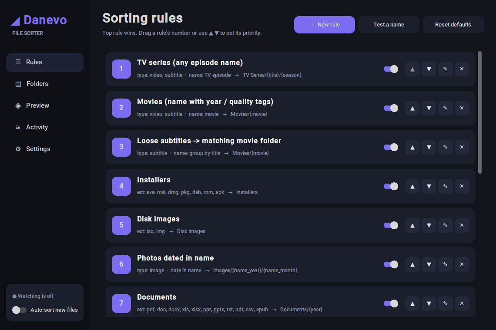
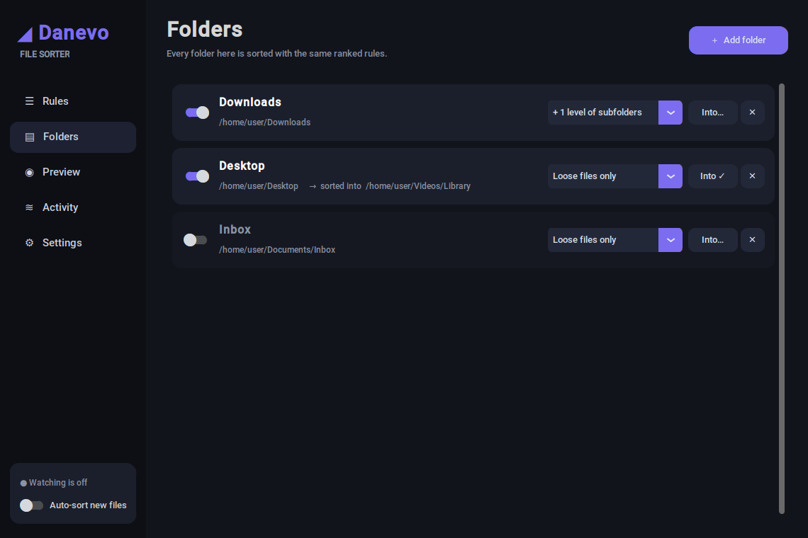
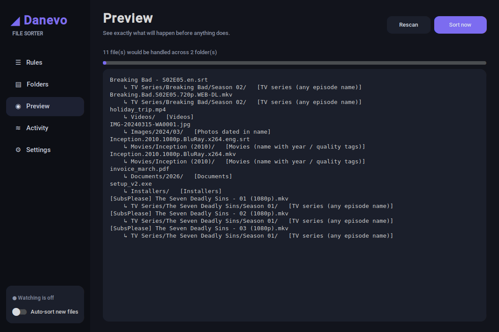

# ◢ Danevo File Sorter

A rule-based file organiser with a modern dark interface. Point it at a messy folder (your Downloads, for
example), describe how you want things sorted, and let it keep the folder tidy automatically from then on.



- **Multiple folders** - organise Downloads, Desktop and more at once. Each folder can include subfolders
  (a folder full of episodes is regrouped and the emptied folder removed) and can sort *into* a separate
  library folder.
- **Ranked rules** - the first matching rule wins, so you control priority (drag the number or use ▲ ▼).
- **Sorts by name, not just extension** - a smart name parser groups a movie, its subtitles and its
  release-style variants under one title (`Inception.2010.1080p.BluRay.x264.mkv` +
  `Inception.2010.eng.srt` -> `Movies/Inception (2010)/`). It understands `S01E02`, `1x02`, `Season 2`,
  anime-style `Title - 05` / `Ep05`, `[SubsPlease]` tags, and borrows the title from the parent folder
  when files are just called `01.mkv`. Title aliases map alternate names to one folder
  (`Nanatsu no Taizai = The Seven Deadly Sins`).
- **Rich conditions** - extension, content type (detected from the file's bytes), name keywords, regex,
  date in the file name, min/max size, minimum age. All conditions on a rule must match.
- **Smart destinations** - placeholders such as `{title}`, `{season}`, `{movie}`, `{year}`, `{ext}`,
  `{kind}`, `{name_year}` and your own regex groups.
- **Watch mode** - new files are sorted the moment they settle; runs quietly from the system tray and can
  start with Windows.
- **Safe by design** - live preview, one-click undo for every batch, never overwrites (adds `(1)`, `(2)`…),
  skips in-progress downloads, duplicates are moved aside (never deleted).
- **Extras** - ZIP-away rules for old files, SHA-256 duplicate detection, a "Test a name" tool.

## Quick start

```bash
git clone https://github.com/<your-username>/danevo-file-sorter.git
cd danevo-file-sorter
pip install -r requirements.txt
python danevo_file_sorter.py
```

Requires Python 3.10+. The tray icon needs `pystray` + `Pillow` (installed by `requirements.txt`);
without them the app still works and simply closes normally.

Prefer a ready-made app? Grab the installer or portable zip from the
[Releases](../../releases) page.

## Folders

Add as many folders as you like on the **Folders** page. For each one choose:

| Option | Meaning |
|---|---|
| Loose files only / + 1 level / All subfolders | whether files inside subfolders are sorted too (off by default, and Preview first!) |
| **Into…** | create `TV Series`, `Movies`… in a separate library folder instead of inside the watched folder |
| Switch | pause one folder without removing it |

Files that are already where the rules want them are left alone, so scanning subfolders is safe to repeat.



## How rules work

Rules are checked top to bottom; the first enabled rule that matches a file decides where it goes.

| Condition | Example |
|---|---|
| Extensions | `pdf, docx, xlsx` |
| Content type | `image, video, subtitle, archive…` (sniffed from the file when the extension is unknown) |
| Smart name pattern | TV episode · movie · any title · shared name |
| Name contains | `invoice, receipt` |
| Regex | `^(?P<client>.+?)_invoice` -> `{client}` |
| Date in name | `IMG-20240315-WA0001.jpg` -> `{name_year}/{name_month}` |
| Size / age | `≥ 2048 MB`, `older than 90 days` |

Destinations are folders inside the watched folder (or absolute paths), e.g. `TV Series/{title}/{season}`.
A rule can also **add to a ZIP** instead of moving (destination `Old Files/{year}` -> `Old Files/2026.zip`).
Existing folders are reused even when their casing or punctuation differs (`breaking bad` = `Breaking.Bad`).

### Naming the destination folder

The destination is plain text mixed with placeholders - click the chips under the box in the rule editor to insert them.

| You type | You get |
|---|---|
| `Archives/{group}` | one folder per family of similar names (Shared name mode) |
| `TV Series/{title}/{season}` | `TV Series/Breaking Bad/Season 02` |
| `Movies/{movie}` | `Movies/Inception (2010)` |
| `Backups/{group} files` | `Backups/MyGame files` (fixed text around a placeholder is fine) |
| `Documents/{year}/{ext}` | `Documents/2026/PDF` |

**Shared name** mode groups files that belong together, for example archives:
- identical family name: `MyGame.part1.rar`, `MyGame.part2.rar`, `MyGame (1).zip`, `MyGame_v1.2.zip` -> `MyGame`
- shared start: `ProjectX_data.zip` + `ProjectX_logs.zip` -> `ProjectX` (a one-word prefix needs 6+ letters, so
  `Final Cut Pro` and `Final Fantasy` are not mixed up)
- copy markers, part/volume numbers, versions and trailing dates are dropped from the folder name
- a lone file whose family folder already exists joins it (`ProjectX_logs.zip` -> existing `Archives/ProjectX`)
- title aliases also rename groups, and a file with no partner falls through to the next rule

Name-based grouping details:
- Episodes with no season marker (`Title - 05`) default to `Season 01`; edit the destination to
  `TV Series/{title}` if you prefer no season folders.
- Three or more files in a folder named `Show 01`, `Show 02`, `Show 03` are recognised as episodes even
  without markers (names with a year, like movie sequels, are never treated as episodes).
- Preview shows exactly where everything would go:



Settings and rules live in `~/.danevo_file_sorter/` (`config.json`, `history.json`).

## Build the Windows app

See [BUILDING.md](BUILDING.md) for the one-click `build.bat`, the Inno Setup installer, and troubleshooting.
Pushing a version tag (`git tag v1.3.0 && git push origin v1.3.0`) builds and publishes both automatically
through GitHub Actions.

## Development

```bash
pip install -r requirements-dev.txt
pytest
```

The sorting engine is independent of the GUI and is covered by headless tests in `tests/`.

## Project layout

```
danevo_file_sorter.py   app: engine + GUI + tray
make_icon.py            generates danevo.png / danevo.ico
build.bat               local Windows build
installer.iss           Inno Setup installer script
version_info.txt        Windows file properties
tests/                  headless engine tests
docs/                   screenshots
.github/workflows/      CI tests + Windows release build
```

## License

[MIT](LICENSE)
